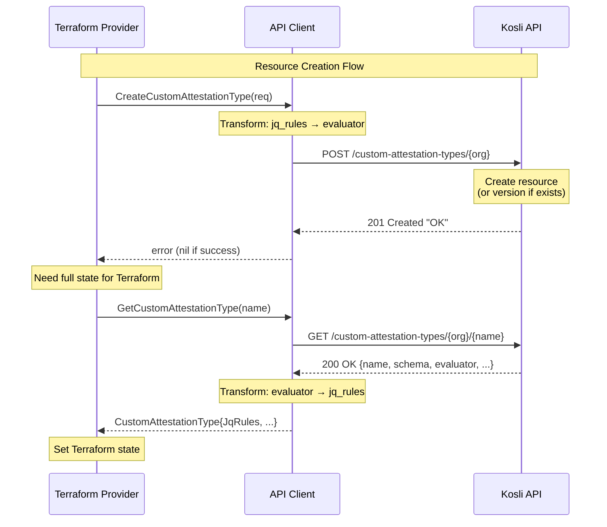

# ADR 002: API Client Architecture and Transformation Layer

## Context

The Kosli API client (`pkg/client/`) needs to interact with the Kosli API while providing a user-friendly interface. Based on ADR 001, we've decided to abstract the API's `evaluator` structure into a simpler `jq_rules` field for users. This requires transformation logic between API format and user-facing format.

**Key consideration**: We may generate the Go SDK automatically from the OpenAPI/Swagger specification in the future, which would generate API types and methods that match the spec exactly.

**API Format (from swagger.json)**:
```json
{
  "name": "person-over-21",
  "description": "Check if person is over 21",
  "evaluator": {
    "content_type": "jq",
    "rules": [".age > 21"]
  },
  "schema": {...}
}
```

**User-Facing Format (per ADR 001)**:
```go
{
    Name:        "person-over-21",
    Description: "Check if person is over 21",
    JqRules:     []string{".age > 21"},
    Schema:      "...",
}
```

## Decision Drivers

1. **Simplicity** - Minimize complexity for initial implementation
2. **Future SDK Generation** - Prepare for potential OpenAPI code generation
3. **Maintainability** - Clear separation of concerns
4. **Testability** - Easy to test transformation logic
5. **Refactoring Cost** - Acceptable effort to migrate later

## Options Considered

### Option A: Transformation in API Methods (Selected for v0.1)

Embed transformation logic directly in the API method implementations.

**Structure:**
```
pkg/client/
├── client.go                           # Core HTTP client
├── errors.go                           # Error handling
├── custom_attestation_types.go         # API methods + transformation
└── custom_attestation_types_test.go    # Tests
```

**Implementation Pattern:**
```go
// User-facing type with both API and user fields
type CustomAttestationType struct {
    Name        string     `json:"name"`
    Description string     `json:"description"`
    Schema      string     `json:"schema"`
    JqRules     []string   `json:"-"`           // User-facing
    Evaluator   *Evaluator `json:"evaluator"`   // API format
}

// Transform in method
func (c *Client) CreateCustomAttestationType(ctx context.Context, req *CreateRequest) error {
    // Transform request: jq_rules → evaluator
    data := map[string]any{
        "evaluator": map[string]any{
            "content_type": "jq",
            "rules":        req.JqRules,
        },
    }

    // Create multipart request and send to API
    // ...

    // API returns "OK" - that's all we do
    return nil
}
```

**Pros:**
- ✅ Simple, straightforward implementation
- ✅ All related code in one place
- ✅ No extra packages or indirection
- ✅ Fast to implement for v0.1

**Cons:**
- ❌ Transformation logic embedded in methods
- ❌ API types and user types mixed in same struct
- ❌ When SDK is generated, requires refactoring
- ❌ Less testable transformation logic

### Option B: Separate Transformation Layer

Create a dedicated transformation layer between API types and user-facing types.

**Structure:**
```
pkg/client/
├── client.go                              # Core HTTP client
├── errors.go                              # Error handling
├── custom_attestation_types.go            # User-facing methods
├── custom_attestation_types_test.go       # API method tests
└── transform/                             # Transformation layer
    ├── custom_attestation_types.go        # Transform logic
    └── custom_attestation_types_test.go   # Transform tests
```

**With Future SDK Generation:**
```
pkg/client/
├── generated/                             # Generated from OpenAPI
│   ├── types.go                          # APICustomAttestationType
│   └── client.go                         # Generated API methods
├── transform/                             # Handwritten
│   └── custom_attestation_types.go       # Conversion logic
└── custom_attestation_types.go            # User-facing wrapper
```

**Implementation Pattern:**
```go
// Separate types
type CustomAttestationType struct {
    Name        string
    Description string
    Schema      string
    JqRules     []string  // User-facing only
}

type APICustomAttestationType struct {
    Name        string     `json:"name"`
    Description string     `json:"description"`
    Schema      string     `json:"schema"`
    Evaluator   *Evaluator `json:"evaluator"`
}

// Transform package
func ToUserFormat(api *APICustomAttestationType) *CustomAttestationType {
    return &CustomAttestationType{
        Name:        api.Name,
        Description: api.Description,
        Schema:      api.Schema,
        JqRules:     api.Evaluator.Rules,
    }
}

// Clean API method
func (c *Client) CreateCustomAttestationType(ctx context.Context, req *CreateRequest) (*CustomAttestationType, error) {
    apiReq := transform.ToAPIFormat(req)
    // Call API
    apiResp, err := callAPI(apiReq)
    return transform.ToUserFormat(apiResp), nil
}
```

**Pros:**
- ✅ Clean separation of concerns
- ✅ Easy to test transformation independently
- ✅ Prepares for SDK generation
- ✅ API types 1:1 with swagger spec
- ✅ Stable user API when API changes

**Cons:**
- ❌ More upfront complexity
- ❌ Additional package to navigate
- ❌ Two separate type definitions
- ❌ Extra indirection

---

## Decision

**Selected: Option A (Transformation in API Methods) for v0.1**

### Rationale

1. **Start Simple**: For the initial implementation (v0.1), we prioritize getting functionality working quickly with minimal complexity.

2. **Single Transformation**: Currently only one field (`jq_rules` ↔ `evaluator`) needs transformation, which doesn't justify a separate package yet.

3. **Acceptable Refactoring Cost**: When we add SDK generation in the future, we can refactor to Option B. The transformation logic is well-contained and easy to extract.

4. **Clear Migration Path**: We know exactly how to migrate to Option B when needed (see "Future Migration" section below).

5. **YAGNI Principle**: Don't build infrastructure we don't need yet. The transformation layer makes sense with SDK generation, but not before.

### Trade-offs Accepted

- **Technical Debt**: We accept that this will require refactoring when adding SDK generation
- **Mixed Concerns**: Transformation logic embedded in API methods (acceptable for v0.1)
- **Less Testable**: Transformation tested via API method tests rather than independently (acceptable given simplicity)

### When to Reconsider

We should migrate to Option B when **any** of these conditions occur:

1. **SDK Generation**: We implement OpenAPI code generation
2. **Multiple Transformations**: More than 2-3 fields require transformation
3. **Shared Transform Logic**: Other packages need the same transformation logic
4. **Complex Transformations**: Transformations become more than simple field mapping

---

## Consequences

### Positive

- **Faster v0.1 Delivery**: Less code to write, simpler structure
- **Easier to Understand**: All code for custom attestation types in one file
- **No Over-Engineering**: Only build what we need now
- **Clear Path Forward**: Well-documented migration strategy

### Negative

- **Refactoring Required**: Will need to restructure when adding SDK generation
- **Mixed Responsibilities**: Transformation logic not separate from API logic
- **Migration Effort**: Future migration will touch multiple test files

### Neutral

- **Testing Approach**: Transformation tested through API method tests
- **Type Definitions**: Single struct with both API and user fields

---

## Implementation (Option A - v0.1)

### Type Definitions

```go
// pkg/client/custom_attestation_types.go

// CustomAttestationType represents a custom attestation type.
// Contains both API format (Evaluator) and user-facing format (JqRules).
type CustomAttestationType struct {
    Name        string     `json:"name"`
    Description string     `json:"description"`
    Schema      string     `json:"schema"`
    JqRules     []string   `json:"-"`           // User-facing (not serialized)
    Evaluator   *Evaluator `json:"evaluator"`   // API format (for transformation)
}

// Evaluator represents the API's evaluator structure
type Evaluator struct {
    ContentType string   `json:"content_type"`
    Rules       []string `json:"rules"`
}

// CreateCustomAttestationTypeRequest is the user-facing request format
type CreateCustomAttestationTypeRequest struct {
    Name        string
    Description string
    Schema      string
    JqRules     []string
}
```

### Transformation Helpers

```go
// toAPIFormat converts user-facing jq_rules to API's evaluator format
func (req *CreateCustomAttestationTypeRequest) toAPIFormat() map[string]any {
    return map[string]any{
        "name":        req.Name,
        "description": req.Description,
        "evaluator": map[string]any{
            "content_type": "jq",
            "rules":        req.JqRules,
        },
    }
}

// fromAPIFormat converts API response to user-facing format
func (at *CustomAttestationType) fromAPIFormat() {
    if at.Evaluator != nil {
        at.JqRules = at.Evaluator.Rules
        at.Evaluator = nil  // Clear API field after transformation
    }
}
```

### Usage in Methods

```go
func (c *Client) CreateCustomAttestationType(ctx context.Context, req *CreateCustomAttestationTypeRequest) error {
    // Transform to API format
    data := req.toAPIFormat()

    // Create multipart form body
    body, contentType, err := createMultipartRequest(data, req.Schema)
    if err != nil {
        return fmt.Errorf("failed to create multipart request: %w", err)
    }

    // Build path
    path := fmt.Sprintf("/custom-attestation-types/%s", c.Organization())

    // Create custom HTTP request (not using client.Post because it sends JSON)
    httpReq, err := http.NewRequestWithContext(ctx, http.MethodPost, c.apiURL+path, body)
    if err != nil {
        return fmt.Errorf("failed to create HTTP request: %w", err)
    }

    // Set headers manually
    httpReq.Header.Set("Content-Type", contentType)
    httpReq.Header.Set("Authorization", fmt.Sprintf("Bearer %s", c.apiToken))
    httpReq.Header.Set("User-Agent", c.userAgent)

    // Execute request
    resp, err := c.httpClient.Do(httpReq)
    if err != nil {
        return fmt.Errorf("failed to execute request: %w", err)
    }
    defer resp.Body.Close()

    // Handle errors
    if resp.StatusCode >= 400 {
        return parseErrorResponse(resp)
    }

    // Verify 201 status
    if resp.StatusCode != http.StatusCreated {
        return fmt.Errorf("unexpected status code: %d", resp.StatusCode)
    }

    // API returns "OK" - that's all we do
    return nil
}
```

---

## Future Migration Path (to Option B)

When SDK generation is implemented, follow these steps:

### Step 1: Generate SDK

```bash
# Generate API types and client from swagger.json
oapi-codegen -package generated swagger.json > pkg/client/generated/client.go
```

> [!NOTE]
> oapi-codegen only supports OpenAPI v3.0 at the moment of this writing. The [OpenAPI 3.1 support?](https://github.com/oapi-codegen/oapi-codegen/issues/373) is being tracked.

### Step 2: Create Transform Package

```go
// pkg/client/transform/custom_attestation_types.go

package transform

import "github.com/kosli-dev/terraform-provider-kosli/pkg/client/generated"

// CustomAttestationType is the user-facing type
type CustomAttestationType struct {
    Name        string
    Description string
    Schema      string
    JqRules     []string
}

// ToUserFormat converts generated API type to user-facing type
func ToUserFormat(api *generated.CustomAttestationType) *CustomAttestationType {
    return &CustomAttestationType{
        Name:        api.Name,
        Description: api.Description,
        Schema:      api.Schema,
        JqRules:     api.Evaluator.Rules,
    }
}

// ToAPIFormat converts user request to API format
func ToAPIFormat(req *CreateRequest) *generated.CreateCustomAttestationTypeRequest {
    return &generated.CreateCustomAttestationTypeRequest{
        Name:        req.Name,
        Description: req.Description,
        Evaluator: &generated.Evaluator{
            ContentType: "jq",
            Rules:       req.JqRules,
        },
    }
}
```

### Step 3: Update API Methods

```go
// pkg/client/custom_attestation_types.go

func (c *Client) CreateCustomAttestationType(ctx context.Context, req *transform.CreateRequest) (*transform.CustomAttestationType, error) {
    apiReq := transform.ToAPIFormat(req)
    apiResp, err := c.generatedClient.CreateCustomAttestationType(ctx, apiReq)
    if err != nil {
        return nil, err
    }
    return transform.ToUserFormat(apiResp), nil
}
```

### Step 4: Update Tests

- Move transformation tests to `transform/` package
- Update API method tests to use transform types
- Verify all tests pass

**Estimated Refactoring Effort**: 2-4 hours

---

## API Response Behavior

**Testing Date**: 2026-01-09

The POST `/custom-attestation-types/{org}` endpoint returns:
- **Status Code**: `201 Created` (always, even for duplicates)
- **Response Body**: `"OK"` (string literal)

### Idempotent/Versioning Behavior

The API uses an **idempotent versioning pattern**:
- POSTing with the same name **always succeeds** (returns 201)
- No 409 Conflict errors for duplicate names
- A new **version** is created **only when the payload changes** (description, schema, or evaluator rules)
- Identical POSTs are truly idempotent (do NOT create new versions)
- The API maintains a version history (accessible via GET with `?version=N` parameter)

**Tested Behavior (2026-01-10):**
```bash
# First POST - creates version 1
POST /custom-attestation-types/org {"name": "test", "description": "v1", ...} → 201 "OK"

# Second POST with IDENTICAL payload - idempotent, no new version
POST /custom-attestation-types/org {"name": "test", "description": "v1", ...} → 201 "OK"
GET /custom-attestation-types/org/test → {"version_count": 1}

# Third POST with CHANGED payload - creates version 2
POST /custom-attestation-types/org {"name": "test", "description": "v2", ...} → 201 "OK"
GET /custom-attestation-types/org/test → {"version_count": 2}
```

**Implications:**
- ✅ No conflict handling needed in the client
- ✅ Safe for Terraform (idempotent creates)
- ✅ Truly idempotent - identical payloads don't create versions
- ✅ Version history tracks actual changes only
- ✅ No unnecessary version proliferation from repeated identical POSTs

### Response Format

This means:
- The API does not return the created object
- We must follow up with GET to retrieve the complete resource
- Implementation: `CreateCustomAttestationType` will call GET after successful POST

### Performance Implications

**Two-Request Pattern Required:**
Every create operation requires:
1. **POST** - Create the resource → returns `"OK"`
2. **GET** - Retrieve the created resource → returns full object

**Request Flow Diagram:**



**Impact Assessment:**

| Context | Impact | Mitigation |
|---------|--------|------------|
| **Terraform Apply** | Low - Terraform reads state after create anyway | Provider already fetches state post-create |
| **Terraform Refresh** | None - Only uses GET | No extra requests |
| **CLI Tools** | Moderate - Noticeable latency for bulk creates | Could be optimized in future |
| **API Efficiency** | Suboptimal - 2x API calls per create | API improvement recommended |

**Terraform Provider Context:**

In Terraform providers, the typical workflow for resource creation is:
1. Call API to create resource
2. Read resource state to populate Terraform state
3. Return state to Terraform

Since Terraform **always reads back the state after creation**, the extra GET request is not actually additional overhead for the provider - it's already required behavior. However, this pattern is still suboptimal because:

- **Network Latency**: Two round-trips instead of one (more noticeable on slow connections)
- **Consistency Risk**: Tiny window between POST and GET where state could change
- **API Load**: Double the requests on Kosli API servers
- **Resource Overhead**: Extra API calls count toward rate limits

**Recommendation for Future API Improvement:**

The Kosli API should be updated to return the created resource in the POST response body:

```json
POST /custom-attestation-types/{org}
Response 201:
{
  "name": "test-type",
  "description": "...",
  "schema": {...},
  "evaluator": {...}
}
```

This is a standard REST pattern that would:
- ✅ Reduce API calls by 50% for creates
- ✅ Eliminate consistency window
- ✅ Reduce network latency
- ✅ Follow REST best practices
- ✅ Improve rate limit efficiency

**Implementation Decision:**

The API client should be a **thin, transparent wrapper** around the API. It should NOT make assumptions or workarounds for API limitations. The POST endpoint returns `"OK"`, so that's what the client should return.

**Client Responsibility:**
```go
func (c *Client) CreateCustomAttestationType(ctx context.Context, req *CreateCustomAttestationTypeRequest) error {
    // 1. POST to create
    resp, err := c.httpClient.Do(postRequest)
    if err != nil {
        return err
    }
    defer resp.Body.Close()

    // 2. Verify 201 status
    if resp.StatusCode != http.StatusCreated {
        return parseErrorResponse(resp)
    }

    // API returns "OK" - that's all we do
    return nil
}
```

**Terraform Provider Responsibility:**
```go
func (r *Resource) Create(ctx context.Context, req resource.CreateRequest, resp *resource.CreateResponse) {
    // 1. Create via API client
    err := client.CreateCustomAttestationType(ctx, createReq)
    if err != nil {
        resp.Diagnostics.AddError("Failed to create", err.Error())
        return
    }

    // 2. Read back to get full state (Terraform pattern)
    attestationType, err := client.GetCustomAttestationType(ctx, name, nil)
    if err != nil {
        resp.Diagnostics.AddError("Failed to read after create", err.Error())
        return
    }

    // 3. Set state
    resp.Diagnostics.Append(resp.State.Set(ctx, attestationType)...)
}
```

**Rationale:**
- ✅ **Separation of concerns**: API client handles API, provider handles Terraform workflow
- ✅ **Transparency**: Client accurately reflects actual API behavior
- ✅ **Flexibility**: Provider can choose different strategies (read after create, optimistic state, etc.)
- ✅ **Testability**: Client tests just test API interactions, not business logic
- ✅ **Future-proof**: If API changes to return object, only client changes, provider stays same

## Related Decisions

- [ADR 001](001-terraform-schema-design.md): Terraform Schema Design - Decided to use `jq_rules` instead of `evaluator` for user-facing API, which necessitates this transformation layer

## References

- [oapi-codegen](https://github.com/deepmap/oapi-codegen)
- [Go SDK Design Patterns](https://go.dev/doc/effective_go)
- [Issue #5](https://github.com/kosli-dev/terraform-provider-kosli/issues/5)
- [Kosli API specification](https://app.kosli.com/api/v2/swagger.json)
